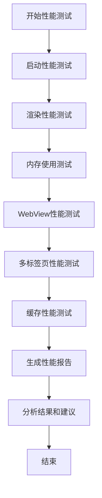

# 性能分析与优化指南

## 概述

本文档提供了FlClash浏览器应用的完整性能测试和优化指南，涵盖性能基准测试、内存使用分析、WebView性能评估以及优化建议。

## 性能测试架构

### 1. 性能测试套件

我们的性能测试系统包含以下核心组件：

#### 1.1 性能基准测试 (`performance_benchmark.dart`)

```dart
class PerformanceBenchmark {
  // 性能阈值定义
  static const Map<String, double> performanceThresholds = {
    'frame_build_time': 16.67,    // 60fps = 16.67ms per frame
    'memory_usage_mb': 256.0,     // 内存使用阈值
    'cpu_usage_percent': 80.0,    // CPU使用率阈值
    'startup_time_ms': 3000.0,    // 启动时间阈值
    'navigation_time_ms': 500.0,  // 页面导航时间阈值
  };
}
```

**测试覆盖范围：**
- 应用启动性能
- UI渲染性能
- 内存使用分析
- WebView性能
- 多标签页性能
- 缓存策略效果

#### 1.2 内存使用测试 (`memory_usage_test.dart`)

```dart
class MemoryUsageTest {
  // 内存监控配置
  static const int _monitoringIntervalMs = 1000; // 监控间隔1秒
  static const int _maxMemoryThreshold = 256 * 1024 * 1024; // 256MB阈值
  static const int _warningMemoryThreshold = 128 * 1024 * 1024; // 128MB警告阈值
}
```

**内存监控功能：**
- 实时内存使用监控
- 内存泄漏检测
- 垃圾回收效果评估
- 内存压力测试

#### 1.3 WebView性能测试 (`webview_performance_test.dart`)

```dart
class WebviewPerformanceTest {
  // WebView性能阈值
  static const Map<String, int> performanceThresholds = {
    'pageLoadTime': 3000,        // 页面加载时间 < 3秒
    'firstPaint': 1000,          // 首次渲染 < 1秒
    'jsExecutionTime': 500,      // JavaScript执行时间 < 500ms
    'memoryUsage': 50 * 1024 * 1024, // 内存使用 < 50MB
    'navigationTime': 200,       // 页面导航时间 < 200ms
    'resourceLoadTime': 1000,    // 资源加载时间 < 1秒
  };
}
```

**WebView测试覆盖：**
- 页面加载性能
- JavaScript执行性能
- 内存使用监控
- 导航响应时间
- 多标签页性能
- 资源加载性能

#### 1.4 性能报告服务 (`performance_reporter.dart`)

```dart
class PerformanceReporter {
  // 报告配置
  static const Map<String, dynamic> reportConfig = {
    'autoGenerateReports': true,
    'reportRetentionDays': 30,
    'maxReportsStored': 100,
    'includeScreenshots': false,
    'includeDetailedMetrics': true,
    'reportFormats': ['json', 'html', 'csv'],
  };
}
```

## 性能指标定义

### 2.1 核心性能指标

| 指标类别 | 指标名称 | 单位 | 优秀阈值 | 良好阈值 | 需优化阈值 |
|---------|---------|------|----------|----------|------------|
| 启动性能 | 应用启动时间 | ms | < 1000 | < 2000 | > 3000 |
| 渲染性能 | 帧构建时间 | ms | < 16.67 | < 20 | > 25 |
| 内存使用 | 内存占用 | MB | < 100 | < 200 | > 256 |
| CPU使用 | CPU占用率 | % | < 30 | < 50 | > 80 |
| WebView | 页面加载时间 | ms | < 1500 | < 3000 | > 5000 |
| 导航 | 页面导航时间 | ms | < 100 | < 200 | > 500 |

### 2.2 性能评分标准

```dart
enum PerformanceRating {
  Excellent,  // 90-100分：性能优秀
  Good,       // 75-89分：性能良好
  Fair,       // 60-74分：性能一般
  Poor,       // <60分：性能较差
}
```

## 性能测试流程

### 3.1 测试执行流程



### 3.2 测试环境要求

**硬件要求：**
- Android: 4GB RAM以上，支持ARM64
- iOS: iPhone 8以上，3GB RAM以上
- 存储空间: 至少500MB可用空间

**软件要求：**
- Flutter SDK: 3.16.0+
- Dart SDK: 3.2.0+
- 测试设备系统版本: Android 8.0+ / iOS 13.0+

### 3.3 测试数据收集

```dart
class MemorySnapshot {
  final DateTime timestamp;
  final int usedMemory;      // 已使用内存(字节)
  final int totalMemory;     // 总内存(字节)
  final int availableMemory; // 可用内存(字节)
  final int gcCount;         // GC次数
  final int heapSize;        // 堆大小
  final int nativeHeapSize;  // 原生堆大小
}
```

## 性能优化策略

### 4.1 内存优化

#### 4.1.1 内存泄漏检测

```dart
void _detectMemoryLeaks(MemorySnapshot snapshot) {
  if (_memorySnapshots.length < 10) return;
  
  // 检查最近10个快照的内存增长趋势
  final recentSnapshots = _memorySnapshots.takeLast(10).toList();
  final memoryGrowth = _calculateMemoryGrowth(recentSnapshots);
  
  if (memoryGrowth > 10 * 1024 * 1024) { // 10MB增长
    _detectedLeaks.add(MemoryLeak(
      timestamp: snapshot.timestamp,
      severity: memoryGrowth > 50 * 1024 * 1024 ? LeakSeverity.High : LeakSeverity.Medium,
      description: '检测到持续内存增长: ${(memoryGrowth / (1024 * 1024)).toStringAsFixed(2)}MB',
    ));
  }
}
```

**优化建议：**
1. **及时释放资源**：确保在组件销毁时释放所有资源
2. **避免静态引用**：减少静态变量对Context的引用
3. **合理使用缓存**：实现LRU缓存策略，控制缓存大小
4. **图片优化**：使用适当尺寸的图片，及时释放不需要的图片

#### 4.1.2 垃圾回收优化

```dart
Future<void> _performGarbageCollection() async {
  // 清理不再使用的对象引用
  _largeObjects?.clear();
  _tempData?.clear();
  
  // 强制触发垃圾回收（在Flutter中有限支持）
  await Future.delayed(const Duration(milliseconds: 100));
}
```

### 4.2 渲染性能优化

#### 4.2.1 帧率优化

```dart
class RenderOptimization {
  // 避免在build方法中进行复杂计算
  Widget build(BuildContext context) {
    return FutureBuilder(
      future: _loadData(),
      builder: (context, snapshot) {
        if (snapshot.hasData) {
          return _buildOptimizedWidget(snapshot.data!);
        }
        return const CircularProgressIndicator();
      },
    );
  }
  
  // 使用const构造函数
  Widget _buildOptimizedWidget(Data data) {
    return const Card(
      child: Padding(
        padding: EdgeInsets.all(16.0),
        child: Text('Optimized Widget'),
      ),
    );
  }
}
```

**优化技巧：**
1. **使用const构造函数**：减少Widget重建
2. **合理使用RepaintBoundary**：隔离重绘区域
3. **避免深层嵌套**：减少Widget树深度
4. **使用SingleChildScrollView**：替代ListView进行懒加载

#### 4.2.2 列表性能优化

```dart
class OptimizedListView extends StatelessWidget {
  final List<Item> items;
  
  const OptimizedListView({Key? key, required this.items}) : super(key: key);
  
  @override
  Widget build(BuildContext context) {
    return ListView.builder(
      itemCount: items.length,
      itemBuilder: (context, index) {
        return ListTile(
          key: ValueKey(items[index].id), // 使用稳定的key
          title: Text(items[index].title),
          subtitle: Text(items[index].subtitle),
          onTap: () => _handleTap(items[index]),
        );
      },
    );
  }
}
```

### 4.3 WebView性能优化

#### 4.3.1 页面加载优化

```dart
class WebviewOptimization {
  Future<void> _optimizePageLoad() async {
    // 启用缓存
    final settings = WebSettings(
      javaScriptEnabled: true,
      domStorageEnabled: true,
      cacheMode: CacheMode.LOAD_DEFAULT,
    );
    
    // 预加载关键资源
    await _preloadCriticalResources();
    
    // 启用硬件加速
    await _enableHardwareAcceleration();
  }
  
  Future<void> _preloadCriticalResources() async {
    // 预加载CSS和JavaScript文件
    final criticalResources = [
      'https://cdn.example.com/critical.css',
      'https://cdn.example.com/main.js',
    ];
    
    for (final resource in criticalResources) {
      await _cacheResource(resource);
    }
  }
}
```

#### 4.3.2 内存管理优化

```dart
class WebviewMemoryManager {
  static const int maxWebviewInstances = 5;
  final List<WebviewController> _activeControllers = [];
  
  Future<WebviewController> createWebview() async {
    // 清理最久未使用的WebView
    if (_activeControllers.length >= maxWebviewInstances) {
      await _cleanupLeastRecentlyUsed();
    }
    
    final controller = WebviewController();
    await controller.loadUrl(_getDefaultUrl());
    _activeControllers.add(controller);
    
    return controller;
  }
  
  Future<void> _cleanupLeastRecentlyUsed() async {
    if (_activeControllers.isNotEmpty) {
      final controller = _activeControllers.removeAt(0);
      await controller.dispose();
    }
  }
}
```

### 4.4 多标签页性能优化

#### 4.4.1 标签页管理

```dart
class TabPerformanceManager {
  static const int maxConcurrentTabs = 10;
  final Map<String, TabPerformance> _tabPerformance = {};
  
  Future<void> addTab(String tabId) async {
    if (_tabPerformance.length >= maxConcurrentTabs) {
      await _suspendLeastRecentlyUsedTab();
    }
    
    _tabPerformance[tabId] = TabPerformance(
      tabId: tabId,
      createdAt: DateTime.now(),
      lastAccessedAt: DateTime.now(),
    );
  }
  
  Future<void> _suspendLeastRecentlyUsedTab() async {
    final sortedTabs = _tabPerformance.entries
        .toList()
        ..sort((a, b) => a.value.lastAccessedAt.compareTo(b.value.lastAccessedAt));
    
    if (sortedTabs.isNotEmpty) {
      final leastUsedTab = sortedTabs.first;
      await _suspendTab(leastUsedTab.key);
    }
  }
}
```

## 性能监控和告警

### 5.1 实时性能监控

```dart
class PerformanceMonitor {
  StreamController<PerformanceAlert>? _alertController;
  Timer? _monitoringTimer;
  
  Stream<PerformanceAlert> startMonitoring() {
    _alertController = StreamController<PerformanceAlert>.broadcast();
    
    _monitoringTimer = Timer.periodic(
      const Duration(seconds: 5),
      _checkPerformanceMetrics,
    );
    
    return _alertController!.stream;
  }
  
  void _checkPerformanceMetrics(Timer timer) {
    // 检查内存使用
    _checkMemoryUsage();
    
    // 检查CPU使用
    _checkCpuUsage();
    
    // 检查帧率
    _checkFrameRate();
  }
  
  void _checkMemoryUsage() {
    final currentMemory = _getCurrentMemoryUsage();
    if (currentMemory > 200 * 1024 * 1024) { // 200MB
      _alertController?.add(PerformanceAlert(
        type: AlertType.Memory,
        severity: AlertSeverity.High,
        message: '内存使用过高: ${currentMemory / (1024 * 1024)}MB',
      ));
    }
  }
}
```

### 5.2 性能告警系统

```dart
class PerformanceAlert {
  final AlertType type;
  final AlertSeverity severity;
  final String message;
  final DateTime timestamp;
  
  PerformanceAlert({
    required this.type,
    required this.severity,
    required this.message,
  }) : timestamp = DateTime.now();
}

enum AlertType {
  Memory,
  CPU,
  FrameRate,
  WebView,
  Network,
}

enum AlertSeverity {
  Low,
  Medium,
  High,
  Critical,
}
```

## 性能基线和对比

### 6.1 性能基线建立

```dart
class PerformanceBaseline {
  final String name;
  final DateTime createdAt;
  final Map<String, PerformanceMetric> metrics = {};
  
  void addMetric(String name, double value, String unit) {
    metrics[name] = PerformanceMetric(
      name: name,
      value: value,
      unit: unit,
      timestamp: DateTime.now(),
    );
  }
  
  double compareWithCurrent(String metricName, double currentValue) {
    final baseline = metrics[metricName];
    if (baseline == null) return 0.0;
    
    return ((currentValue - baseline.value) / baseline.value) * 100;
  }
}
```

### 6.2 性能趋势分析

```dart
class PerformanceTrendAnalyzer {
  List<PerformanceReport> _reports = [];
  
  Future<TrendAnalysis> analyzeTrends(String metricName) async {
    final metricValues = _reports
        .map((report) => _extractMetricValue(report, metricName))
        .where((value) => value != null)
        .cast<double>()
        .toList();
    
    if (metricValues.length < 2) {
      return TrendAnalysis(
        trend: TrendDirection.InsufficientData,
        changePercent: 0.0,
        confidence: 0.0,
      );
    }
    
    final trend = _calculateTrend(metricValues);
    final changePercent = _calculateChangePercent(metricValues);
    final confidence = _calculateConfidence(metricValues);
    
    return TrendAnalysis(
      trend: trend,
      changePercent: changePercent,
      confidence: confidence,
    );
  }
}
```

## 性能优化实践建议

### 7.1 开发阶段优化

1. **代码审查清单**
   - [ ] 检查是否存在内存泄漏
   - [ ] 确认Widget重建优化
   - [ ] 验证异步操作正确性
   - [ ] 检查资源释放时机

2. **性能测试集成**
   ```bash
   # 运行性能测试
   flutter test test/performance_benchmark.dart
   
   # 运行内存测试
   flutter test test/memory_usage_test.dart
   
   # 运行WebView性能测试
   flutter test test/webview_performance_test.dart
   ```

### 7.2 生产环境优化

1. **A/B测试框架**
   ```dart
   class ABTestManager {
     Future<void> runPerformanceTest(String featureA, String featureB) async {
       final testA = await _measureFeaturePerformance(featureA);
       final testB = await _measureFeaturePerformance(featureB);
       
       final result = PerformanceComparison(
         featureA: testA,
         featureB: testB,
         winner: testA.overallScore > testB.overallScore ? featureA : featureB,
       );
       
       await _saveTestResult(result);
     }
   }
   ```

2. **性能监控集成**
   ```dart
   class ProductionPerformanceMonitor {
     Future<void> initialize() async {
       // 启动性能监控
       final monitor = PerformanceMonitor();
       monitor.startMonitoring().listen((alert) {
         _handlePerformanceAlert(alert);
       });
       
       // 定期上传性能数据
       Timer.periodic(const Duration(hours: 1), (_) {
         _uploadPerformanceData();
       });
     }
   }
   ```

### 7.3 持续优化流程

1. **性能回归检测**
   - 每次代码提交自动运行性能测试
   - 性能下降超过5%时触发告警
   - 自动生成性能对比报告

2. **性能优化迭代**
   - 识别性能瓶颈
   - 制定优化方案
   - 实施优化措施
   - 验证优化效果

## 工具和脚本

### 8.1 性能测试脚本

```bash
#!/bin/bash
# run_performance_tests.sh

echo "开始执行性能测试套件..."

# 运行基准测试
echo "运行基准性能测试..."
flutter test test/performance_benchmark.dart

# 运行内存测试
echo "运行内存使用测试..."
flutter test test/memory_usage_test.dart

# 运行WebView测试
echo "运行WebView性能测试..."
flutter test test/webview_performance_test.dart

# 生成报告
echo "生成性能报告..."
flutter run --profile lib/main.dart

echo "性能测试完成"
```

### 8.2 性能分析工具

```dart
class PerformanceAnalyzer {
  Future<AnalysisReport> analyzeReport(PerformanceReport report) async {
    final analysis = AnalysisReport();
    
    // 分析性能瓶颈
    analysis.bottlenecks = _identifyBottlenecks(report);
    
    // 生成优化建议
    analysis.recommendations = _generateRecommendations(report);
    
    // 计算性能得分
    analysis.score = _calculateOverallScore(report);
    
    return analysis;
  }
}
```

## 性能最佳实践

### 9.1 编码规范

1. **内存管理**
   - 使用`const`构造函数减少对象创建
   - 及时释放不再使用的资源
   - 避免静态变量持有Context引用

2. **渲染优化**
   - 合理使用RepaintBoundary
   - 避免在build方法中执行耗时操作
   - 使用ListView.builder进行大量数据渲染

3. **异步操作**
   - 使用FutureBuilder处理异步数据
   - 避免在UI线程执行耗时操作
   - 正确处理异步错误

### 9.2 架构优化

1. **状态管理**
   - 使用Provider/Riverpod进行状态管理
   - 避免不必要的Widget重建
   - 合理划分Widget层级

2. **模块化设计**
   - 分离业务逻辑和UI代码
   - 实现模块间的低耦合
   - 使用依赖注入管理依赖

## 故障排除指南

### 10.1 常见性能问题

| 问题类型 | 症状 | 可能原因 | 解决方案 |
|---------|------|----------|----------|
| 内存泄漏 | 内存使用持续增长 | 未释放的资源引用 | 检查资源释放时机 |
| 帧率下降 | UI卡顿 | 复杂计算阻塞UI线程 | 将计算移至后台线程 |
| 启动缓慢 | 应用启动时间长 | 初始化操作过多 | 优化启动流程，延迟非关键初始化 |
| WebView卡顿 | 页面加载慢 | 资源加载优化不足 | 启用缓存，优化资源加载 |

### 10.2 调试工具

1. **Flutter Inspector**
   - Widget树分析
   - 性能分析
   - 内存使用监控

2. **DevTools**
   - 性能时间线
   - 内存分析器
   - 网络监控

3. **自定义监控**
   ```dart
   class CustomPerformanceTracker {
     void trackWidgetBuild(String widgetName) {
       final startTime = DateTime.now();
       // Widget构建逻辑
       final endTime = DateTime.now();
       
       _recordMetric('widget_build_$widgetName', 
         endTime.difference(startTime).inMilliseconds);
     }
   }
   ```

## 总结

通过系统性的性能测试和优化，我们可以确保FlClash浏览器应用在各种使用场景下都能提供良好的用户体验。关键点包括：

1. **建立完善的性能测试体系**
2. **实施持续的性能监控**
3. **遵循性能优化最佳实践**
4. **建立性能基线和趋势分析**
5. **及时响应性能告警**

定期执行性能测试和优化，将显著提升应用的稳定性和用户体验。